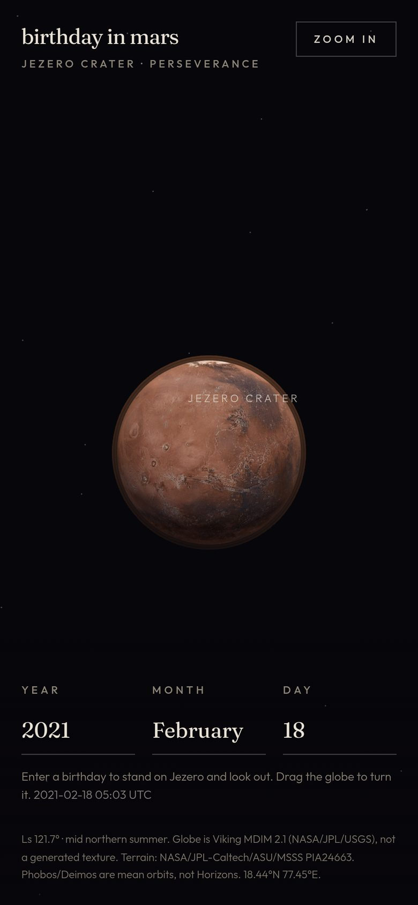
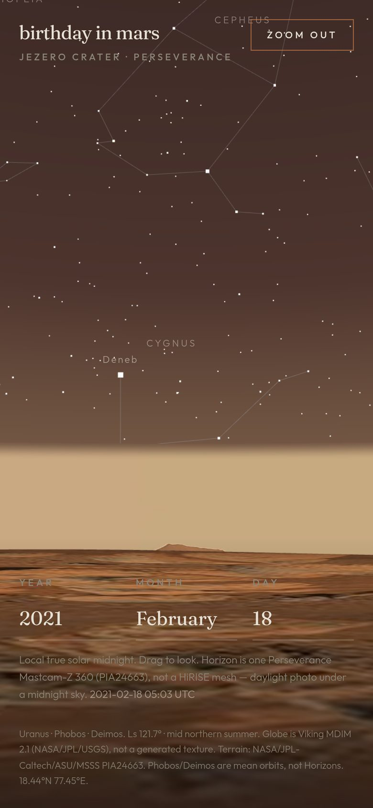

# birthday in mars

The night sky from Jezero crater, computed for a birthday.

[](https://gmunoz512.github.io/mars-sky/)
[](LICENSE)

**[Open the live site →](https://gmunoz512.github.io/mars-sky/)**

<p align="center">
  
  
</p>

Enter a date. Orbit a real NASA mosaic of Mars. Zoom in and stand at Perseverance’s site — Hipparcos stars and IAU constellations over a Mastcam-Z 360, at local true solar midnight.

## Features

- **Orbit globe** — Viking MDIM 2.1 (NASA/JPL/USGS), full sphere in black space. Drag or swipe to rotate; Valles Marineris faces you at rest.
- **Birthday → Jezero** — enter a year, month, and day, then zoom in onto the crater floor. The sky is recomputed for that midnight. Changing the date does not enter the surface on its own.
- **Look around** — Hipparcos stars (mag ≤ 6), IAU stick figures, planets when they are up, Phobos and Deimos.
- **Honest NASA imagery** — globe and terrain are public-domain photographs, not a generated texture or a HiRISE mesh.

Default date is 18 February 2021 (Perseverance landing). `prefers-reduced-motion` skips the zoom tween.

## Run locally

```bash
npm install
npm run dev
```

Vite serves at `/` in development. Then:

```bash
npm test
npm run build
npm run preview
```

## GitHub Pages

The site is live at **https://gmunoz512.github.io/mars-sky/**.

[`.github/workflows/deploy.yml`](.github/workflows/deploy.yml) builds on every push to `main` and deploys `dist/` with the project base `/mars-sky/`. Pages source is **GitHub Actions**.

## Science, briefly

This is a visualization, not a flight-dynamics product.

| Piece | Source | Honesty |
| --- | --- | --- |
| Stars / constellations | Hipparcos via [d3-celestial](https://github.com/ofrohn/d3-celestial) (BSD-2-Clause) | J2000, mag ≤ 6. Same 88 IAU figures as Earth. No proper motion. |
| Planets, Sun, Earth, Moon | [astronomy-engine](https://github.com/cosinekitty/astronomy) | Mars-centered, one-step light time. Best ~1800–2100. |
| Mars orientation | IAU WGCCRE 2015 | ICRF → Jezero horizon (east-north-up). |
| Midnight | Sun hour angle 180° at Jezero | Nearest midnight to 12:00 UTC on that civil date. A sol is 24h 39m 35s. |
| Orbit globe | [Viking MDIM 2.1](https://astrogeology.usgs.gov/search/map/mars_viking_colorized_global_mosaic_232m) · NASA/JPL/USGS | Real mosaic + derived bump. Not a procedural planet. |
| Surface | Mastcam-Z [PIA24663](https://photojournal.jpl.nasa.gov/catalog/PIA24663) · NASA/JPL-Caltech/ASU/MSSS | One 360° photo cylinder + ground disc. Daylight photo, midnight sky. Not a DEM. |
| Phobos / Deimos | Jacobson (2010); Phobos ½ṅ from Brozović et al. (2025) | Mean orbits, **not** Horizons. Fine for “which part of the sky.” Not for transits. |

Aberration, Mars refraction, and stellar proper motion are omitted. Photo azimuth is not surveyed to Jezero north. Full notes and regenerate steps: [`src/assets/mars/SOURCES.md`](src/assets/mars/SOURCES.md).

## Stack

Vite, React, TypeScript, Three.js, Tailwind CSS, astronomy-engine. Client-only — no backend.

## License

Application **code** is [MIT](LICENSE).

NASA / JPL / USGS / ASU / MSSS **imagery is public domain**, not covered by the MIT license. Credit those agencies if you reuse the JPEGs. Star catalog terms stay with d3-celestial (BSD-2-Clause) and ESA Hipparcos. Cite the moon papers above if you reuse that model.
